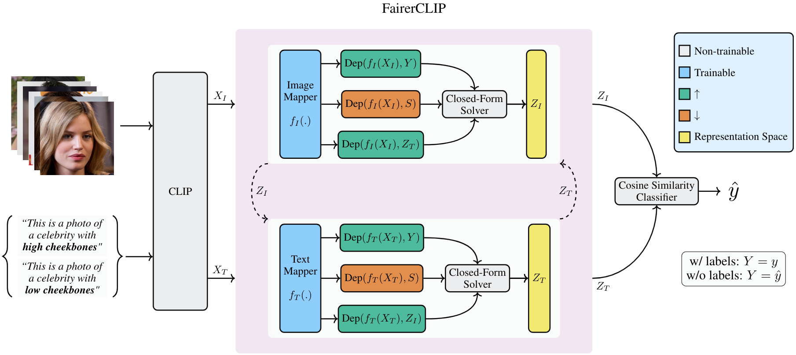

<h1 align="center"><a href="https://sepehrdehdashtian.github.io/Papers/FairerCLIP/index.html">FairerCLIP: Debiasing CLIP’s Zero-Shot Predictions using Functions in RKHSs</a></h1>

<p align="center">
  <a href="https://arxiv.org/abs/2403.15593"></a>
  <a href="https://sepehrdehdashtian.github.io/Papers/FairerCLIP/index.html"></a>
  <a href="https://recorder-v3.slideslive.com/?share=92139&s=ebe4594f-2c48-4884-8168-8fe962dd2630"></a>
  <a href="https://sepehrdehdashtian.github.io/Presentations/FairerCLIP-short.html"></a>
  <a href="https://iclr.cc/media/PosterPDFs/ICLR%202024/18989.png?t=1715123299.2780206"></a>
</p>



Welcome to the official repository for the paper, <a href="https://sepehrdehdashtian.github.io/Papers/FairerCLIP/index.html">FairerCLIP: Debiasing CLIP’s Zero-Shot Predictions using Functions in RKHSs</a>, published in the Twelfth International Conference on Learning Representations (ICLR'24).

Authors: [Sepehr Dehdashtian](https://sepehrdehdashtian.github.io/)\*, [Lan Wang](https://lan-lw.github.io/)\* and [Vishnu Naresh Boddeti](https://vishnu.boddeti.net/)

## Abstract

<p>
  Large pre-trained vision-language models such as CLIP provide compact and general-purpose representations of text and images that are demonstrably effective across multiple downstream zero-shot prediction tasks. 
  However, owing to the nature of their training process, these models have the potential to <b>1)</b> propagate or amplify societal biases in the training data and <b>2)</b> learn to rely on spurious features. 
  This paper proposes FairerCLIP, a general approach for making zero-shot predictions of CLIP more fair and robust to spurious correlations. 
</p>
<p>
  We formulate the problem of jointly debiasing CLIP’s image and 
  text representations in reproducing kernel Hilbert spaces (RKHSs), which affords multiple benefits: 
  <ol>
    <li> <b>Flexibility:</b> Unlike existing approaches, which are specialized to either learn with or without ground-truth labels, FairerCLIP is adaptable to learning in both scenarios.</li>
    <li> <b>Ease of Optimization:</b> FairerCLIP lends itself to an iterative optimization involving closed-form solvers, which leads to 4×-10× faster training than the existing methods.</li>
    <li> <b>Sample Efficiency:</b> Under sample-limited conditions, FairerCLIP significantly outperforms baselines when they fail entirely.</li>
    <li> <b>Performance:</b> Empirically, FairerCLIP achieves appreciable accuracy gains on benchmark fairness and spurious correlation datasets over their respective baselines.</li>
  </ol>
</p>


## How to use
```
git clone https://github.com/human-analysis/FairerCLIP.git
cd FairerCLIP
```

## Requirements
A ```requirements.txt``` file has been provided.

### 1. Download the pre-extracted features
Create a folder named features and download the features and labels [Google Drive](https://drive.google.com/file/d/12rp60K_ifPicHxPHnXlD5v77HeMX8qaK/view?usp=sharing).
```
mkdir features
```
### 2. Mitigating spurious correlation (w/ labels)
```
# Waterbirds Dataset + CLIP ViT-L/14
CUDA_VISIBLE_DEVICES=0 python train.py --config-file configs/debias_waterbird.yaml

# Waterbirds Dataset + CLIP ResNet-50
CUDA_VISIBLE_DEVICES=0 python train.py --config-file configs/debias_waterbird_RN50.yaml

# CelebA Dataset + CLIP ViT-L/14
CUDA_VISIBLE_DEVICES=0 python train.py --config-file configs/debias_celeba.yaml

# CelebA Dataset + CLIP ResNet-50
CUDA_VISIBLE_DEVICES=0 python train.py --config-file configs/debias_celeba_RN50.yaml

```

### 3. Mitigating spurious correlation (w/o labels)
```
# Waterbirds Dataset + CLIP ViT-L/14
CUDA_VISIBLE_DEVICES=0 python train.py --config-file configs/debias_waterbird.yaml --opt nolabel True

# Waterbirds Dataset + CLIP ResNet-50
CUDA_VISIBLE_DEVICES=0 python train.py --config-file configs/debias_waterbird_RN50.yaml --opt nolabel True

# CelebA Dataset + CLIP ViT-L/14
CUDA_VISIBLE_DEVICES=0 python train.py --config-file configs/debias_celeba.yaml --opt nolabel True

# CelebA Dataset + CLIP ResNet-50
CUDA_VISIBLE_DEVICES=0 python train.py --config-file configs/debias_celeba_RN50.yaml --opt nolabel True

```
### 4. Mitigating Intrinsic Dependency
```
CUDA_VISIBLE_DEVICES=0 python train_eo.py --config-file configs/debias_celeba_highcheek.yaml
```

## Citation
If you find this paper and repository useful for your research, please consider citing the paper:
```
@inproceedings{dehdashtian2024fairerclip,
  title={FairerCLIP: Debiasing CLIP's Zero-Shot Predictions using Functions in RKHSs},
  author={Dehdashtian, Sepehr and Wang, Lan and Boddeti, Vishnu Naresh},
  booktitle={International Conference on Learning Representations (ICLR)},
  year={2024}
}
```

## Acknowledgements
The code of model evaluation is primarily inspired by the supplement of [Zhang and Ré](https://openreview.net/forum?id=uPdS_7pdA9p).
